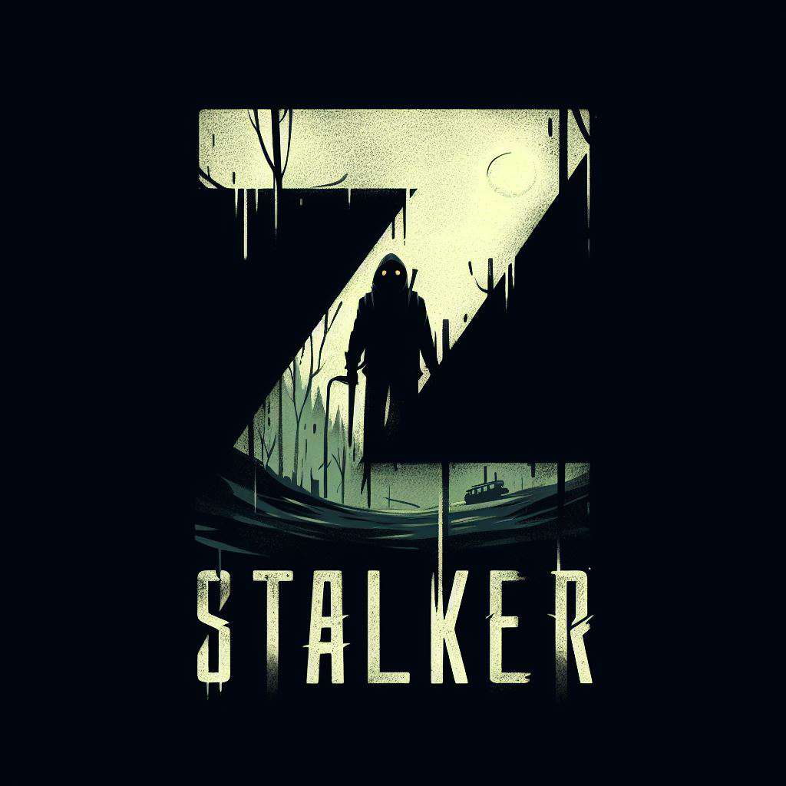

# Cataclysm: Bard legacy

Cataclysm: Bard legacy - Это Форк CDDA, сосредаточенный на треше. Убийство невиновных, а после чего скармливание их остатков оставшимся близким? Почему бы и нет?

    

## Скачивание

**Сборки** [Experimental]([https://cataclysmdda.org/experimental/](https://github.com/Kenshut-not-dead/Cataclysm-Bard-legacy/releases))

**Исходники** - Исходники [.zip archive](https://github.com/Kenshut-not-dead/Cataclysm-Bard-legacy/archive/refs/heads/Bard-legacy.zip), или клонируйте [GitHub repo](https://github.com/Kenshut-not-dead/Cataclysm-Bard-legacy).

## Отличия

Пока Них@я, но планируется следующие:

Портировать из [![Breeze][icon-Breeze]][Breeze] уровни у мобов

Портировать из [![TLG][icon-TLG]][TLG] возможность бросать противников

Портировать из [![EOD][icon-EOD]][EOD] возможность тонкой настройки

В идеале портировать из [![BN][icon-BN]][BN] их реализацию машин, но я не знаю что лучше с точки оптимизаци...

Так же хочется переработать моральный штраф за убийствав, возможно сделаю это ленивым способом, при помощи EoC... Тип если у игрока нет перков типо психопат, убийственный раш, каннибал, то у него через наверное пол года жизни или 200 убийств выработается толерантность.

Возможность пилотирования и конструирования летательных аппаратов не будет доступно обычному выжившему, но можно будет получить при помощи КБМ или прохождения курса у нпс.

Возможность кормить НПС едой из человеческого мяса, а потом наблюдать забавную реакцию если они по какой-то причине узнают вкус или то что они ели это мясо.

Добавление особой промышленности по созданию КБМ, тем самым побудить игроков на исследование мира, а не как в нынешнем дда, сидет возле особых фракций нпс.

Расширение лора игры при помощи введения новых квестов.

Ввести игру в более РПГ направлении. 

Выполнение начальных квестов будет вознаграждать игроков, к примеру квест "Главный герой", после его выполнения вы получите бесплатное увеличение хар-ки силы на 1 ед.

Добавление военной промышленности. Я конечно не знаю есть ли в Новой англии заводы по оружию, но я их добавлю. А так же возможность создания огнестрельного оружия!

Добавление возможности вызвать айродроп при помощи особого устройства (Дань уважения старому моду на айродропы).

Добавление возможности путишествия между мирами. Скажите сложно? Да не особо, мне надо просто спиздить уже почти готовый код, а может быть когда я приступлю к этому, он уже будет готов.

Вернуть в игру возможность коллекционирования. Кто-то скажет что тысячи видов плюшевых игрушек и дакимакур - это ненужная хрень, а я скажу, вся жизнь это хрень, дайте побыть идиотом! И это даже не влияет толком на оптимизацию -_-

Доработать возможность лишения конечности и её замены на бионику. Уже есть данный код, на EoC, просто тогда разрабы дда сказали что твой перс тупо умрет до оказания первой помощи. Но может я хочу увидить эпичную смерть из-за того что подорвался на мине и потерял ногу?

Добавить возможность быстрого переключения между НПС компаньонами.

Возможно добавлю ImGUI когда он будет идеален

Добавление временных баффов от наркотиков. Типо конечно, плюс 1 скорость от высокого настроения после употребление круто, но немного мало, не так ли?

Замедлить ржавчину навыков, мне нравится механика, но она мне кажется немного слишком ускоренной.

Возможно вернуть артефакты на поверхность.

Встроить и адаптировать в игру тупого барта из моего мега [древнего мода](https://github.com/Kenshut/Bard_bard-gigachad).

Встроить и адаптировать в игру мод на аниматроников.

Мне сказали что документация в дда - ху@та. Так что возможно попробую её адаптировать на русский.

Добавить и доработать свой мод [S.T.A.L.K.E.R.](https://github.com/Kenshut-not-dead/CATACLYSM-S.T.A.L.K.E.R.)

Вернуть кислотный дождь, но я не особо уверен, хотя можно сделать его как аномальной зоной из-за раскола реальности, возможно она не будет особо ценной, но как часть лора звучит красиво.

Встроить и адаптировать [мод](https://github.com/chaosvolt/Dorf-Life-CDDA) на пещеры

Встроить [мод](https://gitgud.io/Yomu/onaholes-mod) на мужской вариант вибратора.

Встроить и адаптировать [мод](https://github.com/MutaMan/Reproduction-mod) на возможность продолжения человеческого рода.

Встроить, оптимизировать и адаптировать мой [мод](https://github.com/Kenshut-not-dead/HP-Mind-CDDA/tree/main) на систему рассудка. Сойти с ума от непонятной ху@ты? Звучит заманчиво для меня.

Сделать анимированный титульный экран.

Все коммиты и пул-реквесты в которых я что-то буду удалять, будут называтся "Никаких edgelords", ведь это так забавно и остроумно!

Изменить все лабы, сделать каждую лабу узко специализированной, типо био-лаба, электро-лаба, хим-лаба, лаба по изучению материалов, лаба по изучению бездны. Так же надо будет лорно объяснить их, так же в каждой такой лабе будет встречатся маленький кусочек от другой лабы, к примеру, в лаборатории по изучению материалов нашли материал который нужен для создания по этому его отправили в электро-лабу. Или био-лаба создает мутагены, а поставки получает от хим-лабы.

Убрать ограничение в 10 уровень навыка.

Расширить макс лвл игрока с 20 на 35. Больше делать наверное не имеет смысла, так как я редко убиваю больше 100к мобов

Вернуть роботов в повседневную жизнь, но сделать ограничение по их призыву, чтоб не фармили.

Добавить промышленность по созданию роботов. К примеру будут на них станки позволяющие создать своего робота который будет носить ваши вещи и отвлекать внимание зомби. А при среднем уровне компьютеров перепрограммировать его в боевого, с риском совершить фатальную ошибку =)

Добавить автомобильную промышленность. Вы любите создавать машины с нуля? Тогда эта промышленность обеспечит вас нужными инструментами и материалами.

Расширить бездну, добавить в неё собираемые ресурсы, наподобии кристалов бездны для создания оружия ближнего боя.

Изменение баланса ближнего боя. Так как сейчас многие противники умерают как лохи когда у вас открыты знания слабых мест, по этому нужно увеличить их уворот, чтоб реже попадать в слабые места или сделать слабые места менее доступными в зависимости от типа противника.

Доделать концовку с побегом вместе с Экзоди.

Сделать концовку от центра 01.

Сделать концовку с полной ассимиляцией с XE037.

Сделать концовку с вознесением

Добавить подземную часть центра беженцев и переработать его лор чтобы не понижать оптимизацию слишком сильно. К примеру вся подземная часть была заражена?  

Добавить [мод](https://github.com/Standing-Storm/innawoods-feral-villages) расширение для инвуда на деревни фералов

## Виденье игры

Cataclysm: Bard legacy - Будет безумным куском мяса. Весь мир - это сочетание множественных катаклизмов, а так же является местом с странными возможностями. 

Зомби апокалипсис? Да это база!

Вторжение инопланетян? Тоже должно быть и является важной частью!

Оккультизм осуществил хреномансию? Умножаем!

Ученые порвали ткань мироздания? ДА-ДА!

Мир пострадал от множественных бомбардировок аки фаллаут? Тоже нужно!

Мир наполнили путешественники из других измерений? Беру две копии! 

Выжившему почему-то захотелось заняться копрофилией? Ну... Если вам так охота, то так тому и быть.

Выживший захотел сделать себе сани на кошачьей тяге? IFAW Вас явно уже не достанет.

## Contribute

Cataclysm: Bard legacy является результатом многолетней работы тысячи людей! И вся эта работа проделанна под лицензией Creative Commons Attribution ShareAlike 3.0. Ссылка на лицензию https://creativecommons.org/licenses/by-sa/3.0/
Некоторый код распространяемый вместе с игрой, не является её частью и выпускается под другими лицензиями на программное обеспечение.

Если хотите узнать подробнее как помочь [CONTRIBUTING.md](doc/CONTRIBUTING.md) 

Особая благодарность следующим командам разработчиков

[DDA]: https://github.com/CleverRaven/Cataclysm-DDA
[icon-DDA]: https://img.shields.io/badge/DDA-red?style=flat-square

[![DDA][icon-DDA]][DDA] - Является ядром данного форка

[BN]: https://github.com/cataclysmbnteam/Cataclysm-BN
[icon-BN]: https://img.shields.io/badge/BN-green?style=flat-square

[![BN][icon-BN]][BN] - Является источником старого сайфая 

[TLG]: https://github.com/CleverRaven/Cataclysm-DDA
[icon-TLG]: https://img.shields.io/badge/TLG-red?style=flat-square

[![TLG][icon-TLG]][TLG] - Является источником переработки боя

[EOD]: https://github.com/cataclysmbnteam/Cataclysm-BN
[icon-EOD]: https://img.shields.io/badge/EOD-green?style=flat-square

[![EOD][icon-EOD]][EOD] - Является источником тонкой настройки игры

[Breeze]: https://github.com/WhiteCloud0123/CDDA-Breeze
[icon-Breeze]: https://img.shields.io/badge/Breeze-blue?style=flat-square

[![Breeze][icon-Breeze]][Breeze] - Является источником РПГ взгляда на игру

## Community

Discord:
[https://discord.gg/jFEc7Yp](https://discord.com/invite/KgmqPRrYF3)

